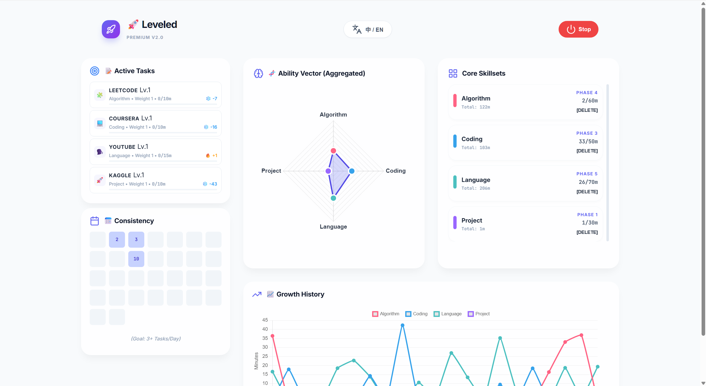
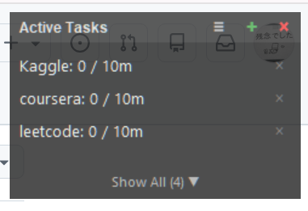

# Leveled (升级没) - Community Edition

[English](#english) | [中文](#中文)

---

<h2 id="english">English</h2>

> Todo lists ask if you did it. <br/>
> Leveled asks if you leveled up.

A local-first growth tracker for **burst learners**.  
It doesn't help you check off tasks; it helps turn fragmented efforts into **visible progression**.

---

### Why does this project exist?

Some people don't lack the desire to grow. Their problem is:
- When motivation strikes, they can learn aggressively.
- But once the rhythm breaks, they easily give up entirely.
- A traditional todo list only records "done" or "not done."
- It fails to answer the real question: **Am I actually getting stronger?**

**Leveled** isn't about doing more tasks. It's about translating scattered, fluctuating, non-linear efforts into continuous, visible growth.

### Who is it for?

Leveled is built for:

- **Burst Learners**: "Three-minute passion", prone to volume sprints, learns a lot at once but gives up entirely when an unbroken streak snaps.
- **Game-Minded Growers**: You feel dopamine from EXP bars, leveling up, builds, and progression, but feel nothing towards ordinary checkboxes.
- **Multi-Interest Learners**: You study more than one strict field. You want the freedom to define "what counts as your growth."

### Core Highlights

**1. A Growth Dashboard, Not a Task List**  
You don't just see "did I do this today," but rather: What abilities are advancing? What is my recent trend? What is my current Lv. and Title?

**2. 100% Custom Ability Dimensions**  
You freely define your ability tree: English, Math, Writing, Fitness, Painting, Reading... it's all up to you.

**3. Automatic Accumulation**  
You don't need to manually check boxes. The system accumulates time and progress passively.

**4. Allows Interruptions**  
Growth isn't linear. Leveled doesn't use shame to force consecutive streaks. Instead, it proves that even if you pause for 3 days, your long-term upward trajectory hasn't been ruined.

**5. Continuous Level/Streak Feedback**  
Not a short dopamine spike from checking a box, but long-term stabilize feedback from watching your EXP push forward.

---

### Community Edition

This repository contains the **Community Edition** of Leveled.

**It is:**
- Local-first
- Privacy-friendly
- Requires no account
- Requires no external server

**It includes:**
- Local behavior tracking
- Custom abilities mapping
- Floating Tkinter UI Overlay
- Progress history & Dashboard
- Level and title system

*It does NOT include: Cloud sync, Multi-device accounts, Paid features, or Server-side analytics. Your data belongs entirely to you and stays securely on your machine.*

---

### License (Non-Commercial)

This repository is source-available under **PolyForm Noncommercial License 1.0.0**.

- Commercial use is not permitted under this license.
- If you want to use this project for commercial purposes, contact the repository owner for a separate commercial license.
- License switch effective date: **April 11, 2026**.
- If you previously received a specific snapshot released under MIT, that snapshot remains under its original MIT terms.

---

### Quick Start (One-Click)

1. **Clone the repository:**
```bash
git clone https://github.com/zannensk/leveled.git
cd leveled
pip install -r requirements.txt
```

**2. Install the Chrome Extension (required for auto-tracking):**
- Open Chrome and go to `chrome://extensions`.
- Enable **Developer Mode** (top right).
- Click **Load unpacked** and select the `chrome_extension` folder.

**3. Launch:**
```
Double-click start.bat
```

---

### 📖 Usage Guide

#### Daily Flow

| Step | Action |
|------|--------|
| **Start** | Double-click `start.bat`. The floating overlay appears on your desktop. |
| **Track** | The Chrome extension automatically tracks time on configured sites. The overlay updates in real time. |
| **Dashboard** | Click the **×** (close) button on the overlay. The server stays running and your browser opens the Dashboard automatically. |
| **Stop** | In the Dashboard, click the red **Stop** button (top right). A "Server Stopped" screen appears — you can then close the browser tab. |

#### Importing Data from Another Machine

> ⚠️ After importing, the app **automatically closes**. You must re-run `start.bat` to apply the imported data.

1. Click the **📁** (folder) icon in the overlay's header bar.
2. Select your exported `progress.db` file.
3. A dialog confirms the data has been staged for import.
4. The overlay **closes automatically**.
5. **Run `start.bat` again** — the new data will be loaded on startup.

#### Managing Skill Dimensions

- **Add a dimension:** In the overlay's **+** (add task) dialog, type a new dimension name in the Dimension field.
- **Delete a dimension:** Open the Dashboard → find the dimension under **Core Skillsets** → click `[DELETE]`.
  > Note: Deleting a dimension with tasks also removes all related tasks and history. A confirmation prompt will appear.

#### Shutting Down

| Method | Effect |
|--------|--------|
| Click **Stop** button in Dashboard | Cleanly stops the server. Close the browser tab when done. |
| Press `Ctrl+C` in the terminal | Also stops the server gracefully. |
| Close the browser tab alone | ❌ Does **not** stop the server. The backend keeps running. |
| Close the overlay window (×) | ❌ Does **not** stop the server. Opens the Dashboard instead. |

---

### Core Highlights

1. **Growth Dashboard, Not a Task List** — See active abilities, recent trends, current Lv. and Title.
2. **100% Custom Ability Dimensions** — Define your own ability tree: Math, English, Writing, Fitness...
3. **Automatic Accumulation** — Time tracked passively via the browser extension.
4. **Interruptions Are OK** — 3-day break? Your long-term trajectory is intact.
5. **Continuous Feedback** — EXP bars, level-ups, and a radar chart replace pointless checkboxes.

---

### Screenshots



---

### Roadmap
- [x] Bilingual Support (ZH/EN)
- [x] One-Click Data Import (📁)
- [x] Dynamic Ability Dimensions (add/delete at runtime)
- [x] Persistent backend (Dashboard stays live after overlay closes)
- [ ] Time range filtering (7d / 30d / 1y) in Dashboard
- [ ] More platform listener hooks (system-level)
- [ ] Fleshed out Rank/Leveling story tree

*(License: PolyForm Noncommercial 1.0.0)*

---

<h2 id="中文">中文</h2>

> Todo list 问你做了没。  
> 升级没，问你今天升级了没。

一个给**爆发型学习者**的本地成长追踪器。  
它不帮你勾任务，它帮你把零碎的努力，变成**可见的升级**。

---

### 为什么会有这个项目？

有些人不是不想成长。  
他们的问题是：
- 一上头能学很多
- 但节奏一断，就容易全盘放弃
- Todo list 只能记录“做没做”
- 却很难回答：**我到底有没有变强？**

**升级没**想解决的，不是“如何做更多任务”，而是：  
> **如何把零碎、波动、非线性的努力，翻译成持续可见的成长。**

---

### 它并不是一个普通的纯代办工具

传统待办工具的反馈单位是：完成一个任务、打一个勾、清空今天的列表。  
但很多重要的事情（学英语、学数学、健身、写作）根本不是“做完就结束”的。这些事情真正重要的不是“今天做完了什么”，而是：**我是不是在持续升级。**

### 适合谁？

升级没更适合这样的人：

**爆发型学习者**
- 三分钟热度，容易冲量，一次能学很多，但一中断就容易自暴自弃。

**游戏脑成长者**
- 对经验条、等级、build、养成有感觉，对普通打卡和小方框无感。

**多兴趣学习者**
- 学的不止一种东西，希望自己定义“什么算成长”。

---

### 核心亮点

1. **成长面板，而非任务列表** — 看到的是：哪些能力在推进、近期趋势、当前等级和称号。
2. **能力维度由你自定义** — 数学、英语、写作、健身……随时新增删除。
3. **自动累计，减少摩擦** — 插件被动计时，无需手动打卡。
4. **允许中断** — 停了 3 天？长期成长轨迹不受影响。
5. **持续反馈** — 经验槽、升级、雷达图，替代毫无意义的小方框。

---

### Community Edition 版本定位

本仓库为 Leveled **社区版（Community Edition）**，本地优先，注重隐私：
- 所有数据保存在本地，无需注册账号
- 不上传行为数据，不联网
- 包含核心追踪、经验条、悬浮窗全功能

*不包含：云同步、多端账号、付费功能。你的数据完全归你所有。*

---

### 快速开始

**1. 克隆 & 安装依赖：**
```bash
git clone https://github.com/zannensk/leveled.git
cd leveled
pip install -r requirements.txt
```

**2. 安装 Chrome 插件（自动计时必须）：**
- 打开 Chrome，访问 `chrome://extensions`
- 开启右上角「开发者模式」
- 点击「加载已解压的扩展程序」，选择项目中的 `chrome_extension` 文件夹

**3. 启动：**
```
双击 start.bat
```

---

### 📖 使用说明

#### 日常使用流程

| 步骤 | 操作 |
|------|------|
| **启动** | 双击 `start.bat`，桌面出现悬浮窗。 |
| **追踪** | Chrome 插件自动在监控的网站上计时，悬浮窗实时更新。 |
| **打开看板** | 点击悬浮窗右上角的 **×** 关闭按钮。服务器**保持运行**，浏览器自动打开看板页面。 |
| **完全关闭** | 在看板右上角点击红色的 **Stop 按钮**，确认后服务器停止，再关闭浏览器标签页即可。 |

#### 导入数据（从其他设备迁移）

> ⚠️ 导入成功后，应用会**自动关闭**。需要**重新运行 `start.bat`** 才能加载新数据。

1. 点击悬浮窗标题栏的 **📁**（文件夹）图标
2. 选择你导出的 `progress.db` 文件
3. 弹窗确认「数据已暂存，即将关闭」
4. 悬浮窗**自动关闭**
5. **重新运行 `start.bat`** — 启动时自动应用导入的数据

#### 管理技能维度（Dimensions）

- **新增维度：** 在悬浮窗的 **+**（添加任务）弹窗中，在「维度」字段里**直接输入新的名称**即可创建
- **删除维度：** 打开看板 → 在「Core Skillsets」面板找到对应维度 → 点击 `[DELETE]`
  > 注意：删除有任务的维度会**同时删除该维度下的所有任务及历史数据**，操作前会弹窗确认

#### 关闭方式对照

| 方式 | 效果 |
|------|------|
| 看板中点击 **Stop 按钮** | ✅ 干净关闭服务器，之后可关闭浏览器 |
| 终端中按 `Ctrl+C` | ✅ 同上，优雅终止 |
| 直接关闭浏览器标签页 | ❌ **不会**停止服务器，后台继续运行 |
| 点击悬浮窗的 × 关闭 | ❌ **不会**停止服务器，仅关闭浮窗并打开看板 |

---

### 截图


---

### 路线图 (Roadmap)
- [x] 中英双语完全支持
- [x] 一键数据导入/迁移 (📁)
- [x] 自定义能力维度（运行时增删）
- [x] 看板持久化（关闭悬浮窗后保持在线）
- [ ] 看板增加时间范围筛选（7d / 30d / 6m / 1y）
- [ ] 更多平台监听支持（系统级 Hook）
- [ ] 更丰富的 Rank 称号剧情树

*(License: PolyForm Noncommercial 1.0.0)*
